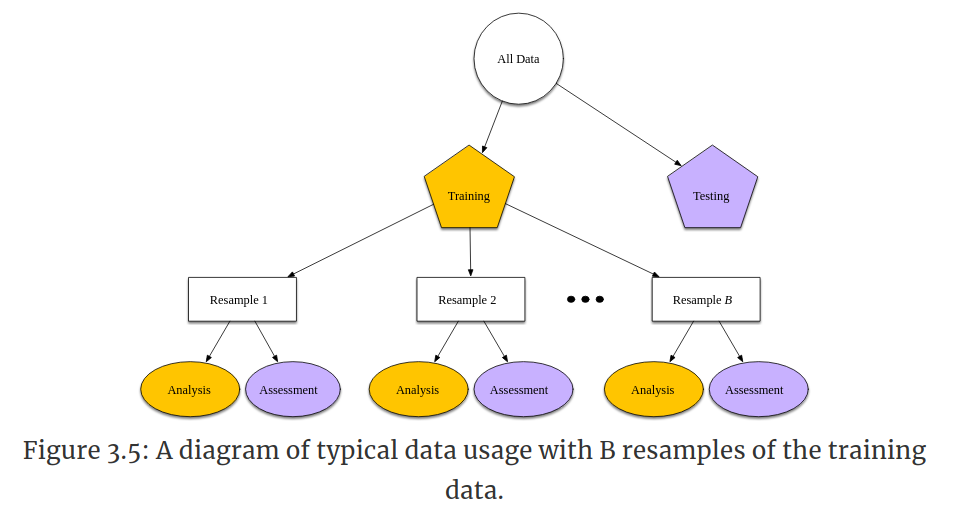

```{r setup, include=FALSE}
knitr::opts_chunk$set(echo = TRUE)
knitr::opts_chunk$set(cache = TRUE)
library(textrecipes)
library(tidymodels)
library(tidytext)
library(stringr)
library(readr)
library(discrim)
library(readr)
library(janitor)
library(lubridate)
library(themis)
```

# Introducción

Vamos a construir un modelo de clasificación para el conjunto de datos de quejas de consumidores al buró de protección financiera de consumidores de EU. El conjunto se puede descargar del sitio de [Kaggle](https://www.kaggle.com/cfpb/us-consumer-finance-complaints?select=consumer_complaints.csv). La fuente original de los datos es el 
[CFPB](https://www.consumerfinance.gov/data-research/consumer-complaints/)

Aquí vamos a seguir de cerca el capítulo 7 del libro de [Hvitfeldt and Silge](https://smltar.com/)

Leemos los datos y quitamos los registros con NA en la queja:

```{r lectura}
complaints <- read_csv("datos/consumer_complaints.csv", col_types =  
                cols(consumer_complaint_narrative = col_character(),                        company_public_response = col_character(),
                     consumer_consent_provided = col_character())) %>% 
  drop_na(consumer_complaint_narrative) %>% 
  mutate(date_received = parse_date_time(date_received,"mdY"))
             
glimpse(complaints)
```

Hay `r dim(complaints)[1]` registros y `r dim(complaints)[2]` variables.
Lo que queremos predecir es el producto al que se refiere la queja:
```{r}
complaints %>% 
  group_by(product) %>% 
  tally() %>% 
  arrange(desc(n))
```

Así luce la narrativa de las primeras quejas:
```{r}
head(complaints$consumer_complaint_narrative,2)

```

Quitamos los caracteres de fin de línea: 
```{r}
fin_linea <- "\\n"

complaints$consumer_complaint_narrative <- str_replace_all(complaints$consumer_complaint_narrative,fin_linea,"")

head(complaints$consumer_complaint_narrative,2)
```

La serie de caracteres "XXX.." que vemos en el texto se usan para proteger la información personal de los consumidores. Hay que verificar
siempre que mecanismo es el usado en el conjunto de datos con el que
estamos trabajando.

Las cantidades monetarias están rodeadas por {}, como por ejemplo {\$75.00}. Esto puede resultar conveniente si en algún momento queremos extraer esta información. 

# Un primer modelo de clasificación

Trataremos de predecir la variable `product` a las que se refieren
las quejas. En una primera instancia, haremos la clasificación de
forma binaria, tratando de determinar si una queja se refiere a 
"Debt collection" o no.

También hay que decidir que variables incluir como predictoras
en el modelo. Por lo pronto incluiremos:

 - La fecha (`date_received`)
 - El texto de la queja (`consumer_complaint_narrative`)
 - La etiqueta (`tags`)

La etiqueta puede ser de tres tipos:


```{r}
complaints %>% 
  group_by(tags) %>% 
  tally() %>% 
  arrange(desc(n))

```


Otra variable que podría ser interesante es la forma en la que
se introdujo la queja pero en este caso no es útil porque todas
son la misma:

```{r}
complaints %>% 
  group_by(submitted_via) %>% 
  tally() %>% 
  arrange(desc(n))

```

Reclasifiquemos `product` para que tenga solo dos niveles:

```{r}
complaints2class <- complaints %>%
  mutate(product = factor(if_else(product == "Debt collection",
                                  "Debt" ,"Other"))
         )
```

Verifiquemos contando de nuevo cuantos registros en cada categoría:

```{r}
complaints2class %>%  
  group_by(product) %>% 
  tally()

```

## División entrenamiento y prueba

Ahora, dividimos los datos en un conjunto de entrenamiento y prueba.
Por defecto 75% de los datos se usan para entrenamiento y el restante 
25% para prueba.

```{r division}
complaints_split <- initial_split(complaints2class, strata = product)

complaints_train <- training(complaints_split)
complaints_test <- testing(complaints_split)
```

Verifiquemos las dimensiones de los conjuntos:

```{r}
dim(complaints_train)
dim(complaints_test)
```

Una manera muy usada para evaluar el modelo es dividir
el conjunto de entrenamiento en *B* remuestras, cada una de las
cuales esta compuesta de un subconjunto de entrenamiento y un
subconjunto de evaluación:


(Fuente: @kuhn_johnson_2020 )

El modelo se ajusta *B* veces y las medidas de rendimiento del
modelo son el promedio de estos ajustes.

## Preprocesamiento

Primero se especifica "la receta", el conjunto de pasos necesarios
para preparar nuestros datos para el modelo

### La receta
Como los modelos a usar tienen atributos numéricos, tenemos que
convertir las características del texto en datos numéricos.

Inicializamos el procesamiento usando:

```{r}
complaints_rec <-
  recipe(product ~ date_received + tags + consumer_complaint_narrative,
         data = complaints_train
  )
```

Comencemos primero con la variable `date_received`. El siguiente código:

 - Extrae el mes y el día de la semana

 - Borra la fecha original

 - Convierte el mes y el día de la semana a variables indicadoras

```{r}
complaints_rec <- complaints_rec %>%
  step_date(date_received, features = c("month", "dow"), role = "dates") %>%
  step_rm(date_received) %>%
  step_dummy(has_role("dates"))
```

Seguimos con la variable `tags`. Aquí:

 - Creamos la especificación para datos faltantes

 - Convertimos la variable a un tipo indicador

```{r}
complaints_rec <- complaints_rec %>%
  step_unknown(tags) %>%
  step_dummy(tags)
```

Finalmente, procesamos la variable que contiene las quejas. En este caso:

 - Tokenizamos en palabras
 
 - Removemos las palabras vacías
 
 - Seleccionamos solo las 500 variables más frecuentes
 
 - Calculamos *tf-idf*
 
```{r receta}
complaints_rec <- complaints_rec %>%
  step_tokenize(consumer_complaint_narrative) %>%
  step_stopwords(consumer_complaint_narrative) %>%
  step_tokenfilter(consumer_complaint_narrative, max_tokens = 500) %>%
  step_tfidf(consumer_complaint_narrative)
```

Una vez especificados los pasos, estamos listos para aplicar o 
preparar (`prep`) la receta

### Preparar la receta

```{r preparacion}
complaint_prep <- prep(complaints_rec)
```

Otra forma alternativa de trabajar es definir un flujo de trabajo o `workflow` e incluir los pasos de preprocesamiento, el paso de
aplicar el modelo, etc. en en el flujo de trabajo usando `workflow`:

```{r wf}
complaint_wf <- workflow() %>%
  add_recipe(complaints_rec)
```

El siguiente paso es especificar el modelo

## Clasificador bayesiano ingenuo (*Naive Bayes classifier*)

Es un modelo bastante usado en NLP porque permite el uso de muchas
variables como las que se tiene cuando se procesa texto. Se basa
en calcular la probabilidad de que un elemento se clasifique de
cierta manera usando el teorema de Bayes. El adjetivo
"ingenuo" se debe a que se presume que las diferentes variables son
independientes una de la otra, lo cual no es una suposición muy
realista en la mayoría de los casos. 

### Especificación del modelo

Primero especificamos el tipo de modelo y el *motor* con el cual
lo vamos a ejecutar. Lo del motor se refiere a que hay mas de una
librería en R que se puede utilizar para la misma tarea y en ese
paso especificamos cual es la librería en particular que queremos
usar

```{r naivebayes}
nb_spec <- naive_Bayes() %>%
  set_mode("classification") %>%
  set_engine("naivebayes")
nb_spec
```

En este paso finalmente ajustamos el modelo. Para eso añadimos
al flujo de trabajo la especificación del modelo y llamamos
a `fit`:

```{r}
nb_fit <- complaint_wf %>%
  add_model(nb_spec) %>%
  fit(data = complaints_train)
```

El siguiente paso es ver que tan bueno resulta el modelo comparando
el ajuste con el conjunto de prueba. Sin embargo, es mejor
hacer el ajuste usando una validación cruzada de diez pliegos, como
discutimos antes.

### Evaluación

Definimos los pliegos. Por defecto son 10, cada uno con el 90% de 
datos como entrenamiento y el 10% restante de evaluación

```{r validacioncruzada} 
complaints_folds <- vfold_cv(complaints_train)

complaints_folds
```

Actualizamos nuestro flujo de trabajo para incluir el modelo:

```{r}
nb_wf <- workflow() %>%
  add_recipe(complaints_rec) %>%
  add_model(nb_spec)

nb_wf
```

y ajustamos de nuevo el modelo esta vez usando validación cruzada

```{r}
nb_rs <- fit_resamples(
  nb_wf,
  complaints_folds,
  control = control_resamples(save_pred = TRUE)
)
```

Ahora si recogemos las métricas que evaluan el modelo en 
todos los pliegos y sus respectivas predicciones:

```{r evaluacionbayes}
nb_rs_metrics <- collect_metrics(nb_rs)
nb_rs_predictions <- collect_predictions(nb_rs)
```

Las métricas principales son la precisión (`accuracy`) y el área
bajo la curva ROC. Ambas métricas, mientras más cercanas a uno
mejor.

```{r}
nb_rs_metrics
```

Podemos dibujar la [curva ROC](https://es.wikipedia.org/wiki/Curva_ROC) para el modelo:

```{r curvaroc}
nb_rs_predictions %>%
  group_by(id) %>%
  roc_curve(truth = product, .pred_Debt) %>%
  autoplot() +
  labs(
    color = NULL,
    title = "Receiver operator curve for US Consumer Finance Complaints",
    subtitle = "Each resample fold is shown in a different color"
  )
```

También podemos visualizar la [matriz de confusión](https://en.wikipedia.org/wiki/Confusion_matrix), en este caso, para el primer pliego

```{r confusion1}
nb_rs_predictions %>%
  filter(id == "Fold01") %>%
  conf_mat(product, .pred_class) %>%
  autoplot(type = "heatmap")
```

Veamos si es posible mejorar estos resultados con un modelo
diferente

## Modelo de máquinas de soporte vectorial (SVM) 

Los modelos de máquinas de soporte vectorial son un tipo de modelo
de aprendizaje automático que  puede usarse en tareas de clasificación y regresión y que ha sido usado con éxito en tareas de clasificación
de texto.

Comparemos el modelo anterior con este modelo a ver cual de los
dos tiene mejor *performace*.

Igual que antes, especificamos el tipo de modelo y el motor de
aprendizaje:

```{r svm}
svm_spec <- svm_rbf() %>%
  set_mode("classification") %>%
  set_engine("liquidSVM")

```

y definimos un nuevo flujo de trabajo con el mismo preprocesamiento y esta nueva especificación de modelo:

```{r}
svm_wf <- workflow() %>%
  add_recipe(complaints_rec) %>%
  add_model(svm_spec)
```

Ahora ajustamos el modelo. Como SVM no produce probabilidades como 
el modelo anterior, especificamos metricas un poco diferentes:

 - `sensitivity`: sensibilidad o tasa de verdaderos positivos
 - `specificity`: especificidad o tasa de verdaderos negativos

```{r}
svm_rs <- fit_resamples(
  svm_wf,
  complaints_folds,
  metrics = metric_set(accuracy, sensitivity, specificity),
  control = control_resamples(save_pred = TRUE)
)
```

Recopilamos las metricas del ajuste anterior:

```{r evalsvm}
svm_rs_metrics <- collect_metrics(svm_rs)
svm_rs_predictions <- collect_predictions(svm_rs)
```

```{r}
svm_rs_metrics
```

La precisión mejoró. Veamos ahora la matriz de confusión:

```{r}
svm_rs_predictions %>%
  filter(id == "Fold01") %>%
  conf_mat(product, .pred_class) %>%
  autoplot(type = "heatmap")
```

Mejoró también la separación entre las clases.

Ahora, pongamosle las cosas un poco más complicadas al modelo
haciendo una clasificación múltiple

# Clasificación multiple

```{r}
set.seed(1234)

multicomplaints_split <- initial_split(complaints, strata = product)

multicomplaints_train <- training(multicomplaints_split)
multicomplaints_test <- testing(multicomplaints_split)
```

```{r}
multicomplaints_rec <-
  recipe(product ~ date_received + tags + consumer_complaint_narrative,
    data = multicomplaints_train
  ) %>%
  step_date(date_received, features = c("month", "dow"), role = "dates") %>%
  step_rm(date_received) %>%
  step_dummy(has_role("dates")) %>%
  step_unknown(tags) %>%
  step_dummy(tags) %>%
  step_tokenize(consumer_complaint_narrative) %>%
  step_stopwords(consumer_complaint_narrative) %>%
  step_tokenfilter(consumer_complaint_narrative, max_tokens = 500) %>%
  step_tfidf(consumer_complaint_narrative) %>%
  step_downsample(product)
```

```{r}
multicomplaints_folds <- vfold_cv(multicomplaints_train)
```

```{r}
multi_svm_wf <- workflow() %>%
  add_recipe(multicomplaints_rec) %>%
  add_model(svm_spec)

multi_svm_wf
```

```{r}
multi_svm_rs <- fit_resamples(
  multi_svm_wf,
  multicomplaints_folds,
  metrics = metric_set(accuracy),
  control = control_resamples(save_pred = TRUE)
)
```

```{r}
multi_svm_rs
```

```{r}
multi_svm_rs_metrics <- collect_metrics(multi_svm_rs)
multi_svm_rs_predictions <- collect_predictions(multi_svm_rs)
```

```{r}
multi_svm_rs_metrics
```

```{r}
multi_svm_rs_predictions %>%
  filter(id == "Fold01") %>%
  conf_mat(product, .pred_class) %>%
  autoplot(type = "heatmap") +
  scale_y_discrete(labels = function(x) str_wrap(x, 20)) +
  scale_x_discrete(labels = function(x) str_wrap(x, 20))

```

```{r}
multi_svm_rs_predictions %>%
  filter(id == "Fold01") %>%
  filter(.pred_class != product) %>%
  conf_mat(product, .pred_class) %>%
  autoplot(type = "heatmap") +
  scale_y_discrete(labels = function(x) str_wrap(x, 20)) +
  scale_x_discrete(labels = function(x) str_wrap(x, 20))

```

# Los mecanismos de anonimización

# Referencias